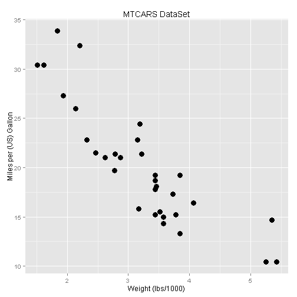

Developing Data Products - Course Project
=====================
author: Peter Seidel  
date: Sat Dec 26 23:50:03 2015  
transition: rotate

MTCARS Explorer Application
=====================
type: sub-section
A **shiny** app was created to explorer some of the variables in the **mtcars** R dataset.
https://scatalina5.shinyapps.io/09_DevelopingDataProducts

The application does the following:
- Allows you to select specific ranges or values for some of the mtcars variables.
- Calculates the mean weight & MPG for the selected data.
- Plots weight vs MPG for the selected observations.
- Creates a table listing the variables for the selected data.


MTCARS Dataset
=====================
type: sub-section
The data was extracted from the 1974 Motor Trend US magazine, and comprises fuel consumption and 10 aspects of automobile design and performance for 32 automobiles (1973-74 models).  
A data frame with 32 observations on 11 variables.  

```r
library(datasets)
data(mtcars)
head(mtcars,1)
```

```
          mpg cyl disp  hp drat   wt  qsec vs am gear carb
Mazda RX4  21   6  160 110  3.9 2.62 16.46  0  1    4    4
```

Example Calculations
=====================
type: sub-section
The following calculations were performed on all 32 observations in the mtcars dataset.  Using the **MTCARS Explorer Application**, you can customize which observations are included in the mean calculations.

```r
mean(mtcars$wt)*1000
```

```
[1] 3217.25
```

```r
mean(mtcars$mpg)
```

```
[1] 20.09062
```

Example Plot
=====================
type: sub-section
 

